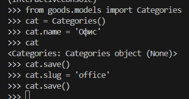
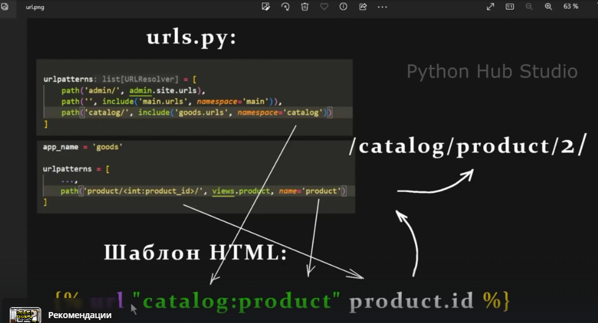
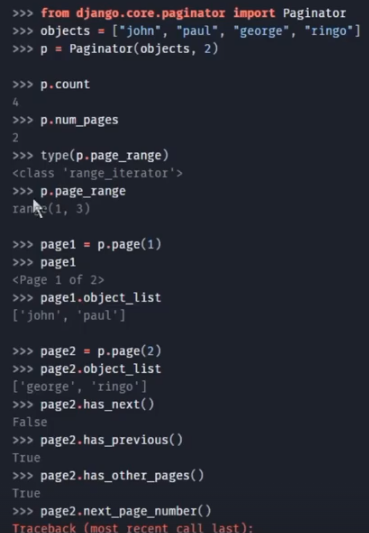

- wsgi
- asgi
- pycache
- копирование проекта (по шаблону, как делали в SF)
- статические файлы в Django

- Q-объекты

### Структура проекта
**Сущности**


Чем лучше программист разобьёт приложение на разные структурные компоненты, тем будет проще:
- Обслуживать код
- Масштабировать
- Копировать структуру в другие проекты

**Приложения в проекте**


### pip
`pip` - менеджер пакетов для языка программирования python. Он служит для установки, обновления, удаления и управления программными пакетами (библиотеками, модулями), написанными на Python.

### Решение проблемы с активацией venv
1. Отключение защиты


2. `file -> preferences -> settings`:


### Файлы
- `__pycache__` - закэшированная версия файлов внутри backend (startproject) для ускорения запуска. Появляется при первом запуске приложения в каждой папке, где есть python-файлы.
- `__init.py__` - говорит интерпретатору пайтон, что все файлы связаны (пакет из взаимосвязанных файлов). Файл всегда пуст.
- `asgi, wsgi` - Файлы отвечают за "общение" Django-приложения с сервером. Это стандартизированные протоколы взаимодействия между сервером и приложением. 
- `urls.py` - маршруты приложения.
- `apps.py` - настройка конфигурации конкретного приложения

### WSGI и ASGI
**WSGI**
WSGI (Web Server Gateway Interface) - apache, Nginx, Gunicorn, ... - стандартный синхронный протокол взаимодействия (для каждого запроса-ответа создаётся отдельный поток выполнения). Лучше использовать для интернет-магазинов.

**ASGI**
ASGI (Asynchronous Server Gateway Interface) - асинхронное взаимодействие между Django и сервером. 


**Использование**
Если написан синхронный вариант - публикуем на сервер, поддерживающий это решение (Apache, Nginx, Gunicorn, ...), если асинхронный - то публикуем на сервер, поддерживающий такой способ взаимодействия.
WSGI лучше для интернет-магазинов, онлайн-порталов, ASGI - стриминговые платформы, онлайн-чаты.


### MVC наглядно


При переходе по маршруту срабатывает закреплённый view, который выдаёт логику (достаёт информацию из базы данных -models) и прикручивает шаблоны.


### Содержимое request


### Разное
- Отображение динамических данных в шаблоне
```python
def index(request):
    """Представление (контроллер) для главной страницы"""
    context = {
        'title': 'Home',
        'content': 'Главная страница магазина - HOME',
        'list': ['first', 'second'],
        'dict': {'first': 1},
        'bool': True
    }
    return render(request, 'main/index.html', context)
```
```html
<body>
    <p>{{ content }}</p>
    <p>{{ list }}</p>
    <p>{{ list.0 }}</p> <!-- first  (через точку в списке) -->
    <p>{{ dict }}</p>
    <p>{{ dict.first }}</p> <!-- 1 (по ключу в словаре) -->
    <p>{{ bool }}</p>
```

**Структура папок**
- `app -> templates -> app -> files`
- `app -> static -> app -> files` (если стили для конкретного приложения)


### Команды
- `git log --graph --all --oneline` - вся история коммитов в одной строчке
- `git checkout 80879fe` (хэш коммита) - переход к конкретной версии кода


### Атрибут name (urls.py)
Атрибут name служит уникальным идентификатором для конкретного пути. Это ключевой механизм для обратного разрешения URL (reverse URL resolution) - то есть для получения URL-адреса по его имени, а не по жёстко прописанной строке.

### Атрибут namespace
Пространство имён (namespace) в Django-маршрутах нужно, чтобы однозначно различать URL-адреса, когда в проекте есть:
- Несколько приложений с одинаковыми именами маршрутов
- Одно приложение, подключённое несколько раз с разными префиксами

1. Указываем namespace в корневом urls
```python
 path('', include('main.urls', namespace='main')),
 ```
2. В urls приложения прописываем
 ```python
app_name = 'main'  # иначе django выдаст ошибку, не обязательно должен совпадать
 ```
3. В шаблонах, где используется путь (url), дополняем префикс по имени
```python
<a class="navbar-brand" href="">Home</a>
```

### app_name (urls)
app_name определяет логическое имя приложения (его идентификатор внутри проекта). Используется для группировки маршрутов внутри приложения. Должно быть уникальным среди всех приложений проекта.
app_name - кто я? (приложение)
namespace - где я? (контекст подключения)

app_name определяет приложение, namespace определяет его экземпляр в URL-дереве.


### Работа с моделями через shell
1. Создание записи


### Создание копии БД в json
` python -Xutf8 manage.py dumpdata goods.Categories -o fixtures/goods/cats.json --indent=4`

### ORM
1. Двойная фильтрация в условии
`Products.objects.filter(price__lt=300).filter(price__gt=100).order_by('-price')` (order_by можно поставить перед первым filter)

2. Поиск товара по категориям
`Products.objects.filter(category__id=7)` (после __ название поля)
`Products.objects.filter(category__slug='kuhnya')`

3. Проверка запроса
```sql
goods = Products.objects.filter(category_id=7)
gooods.exists()
-- SELECT 1 AS "a"
-- FROM "product"
-- WHERE "product"."category_id" = 7
-- LIMIT 1 [0.28ms]
-- Out[9]: True
```


### templatetags
1. `register = template.Library()` - добавление пользовательской логики в шаблоны Django.
- `template.Library()` - создаёт экземпляр библиотеки шаблонов
- `register` - переменная, через которую регистрируются кастомные теги и фильтры.

2. `@register.simple_tag()` - декоратор, превращающий функцию в шаблонный тег. Особенности:
- Позволяет вызывать Python-функцию прямо в шаблоне Django
- Тег доступен в шаблонах после импорта библиотеки
- Обработка аргументов: может принимать параметры из шаблона (опционально)
- Возвращает значение, которое вставляется в шаблон

### Обратное разрешение URL-адресов


## Пагинация

### Каноничная версия 
**Контроллер**
```python
from django.core.paginator import Paginator
from django.shortcuts import get_list_or_404, render
from goods.models import Products 


def catalog(request, cat_slug):
    
    page = request.GET.get('page', 1)
    
    if cat_slug == 'vse-tovary':
        goods = Products.objects.all()
    else:
        goods = get_list_or_404(Products.objects.filter(category__slug=cat_slug))

    paginator = Paginator(goods, 3)  # Выводим по 3 товара на каждую страницу
    current_page = paginator.page(int(page))  # Текущая страница, отображаемая пользователю
    
    context = {
        "title": "Home - Каталог",
        "goods": current_page,  # queryset урезан до количества отображаемых элементов. Объект queryset расширяется методами пагинатора (page_range и т.д.)
        "slug_url": cat_slug,
    }
    
    
    return render(request, "goods/catalog.html", context)
```

**Маршруты**
```python
from django.urls import path
from goods import views

app_name = 'goods'

urlpatterns = [
    path('<slug:cat_slug>/', views.catalog, name='index'),
    path('product/<slug:product_slug>', views.product, name='product'),
]
```

**Шаблон**
```html
<!-- Пагинация -->
<nav aria-label="Page navigation example">
  <ul class="pagination justify-content-center my-4">
    <div class="custom-shadow d-flex">
      <li class="page-item disabled">
        <a
          class="page-link"
          href="
          ?page={{ goods.previous_page_number }}
          
          #
          
        "
          >Назад</a
        >
      </li>

      
      
      <li class="page-item active">
        {# Браузер автоматически открывает URL-адрес с указанными параметрами #}
        <a class="page-link" href="?page={{ page }}"  
          >{{ page }}</a
        >
      </li>
      
      

      <li class="page-item disabled">
        <a
          class="page-link"
          href="
          ?page={{ goods.next_page_number }}
        
        #
        
        "
          >Вперёд</a
        >
      </li>
    </div>
  </ul>
</nav>
```


### Первая версия (не рекомендуемая)
**Контроллер**
```python
from django.core.paginator import Paginator
from django.shortcuts import get_list_or_404, render
from goods.models import Products 


def catalog(request, cat_slug, page=1):
    
    if cat_slug == 'vse-tovary':
        goods = Products.objects.all()
    else:
        goods = get_list_or_404(Products.objects.filter(category__slug=cat_slug))

    paginator = Paginator(goods, 3)  # Выводим по 3 товара на каждую страницу
    current_page = paginator.page(page)  # Текущая страница, отображаемая пользователю
    
    context = {
        "title": "Home - Каталог",
        "goods": current_page,  # queryset урезан до количества отображаемых элементов. Объект queryset расширяется методами пагинатора (page_range и т.д.)
        "slug_url": cat_slug,
    }
    
    
    return render(request, "goods/catalog.html", context)
```

**Маршруты (goods)**
```python
from django.urls import path
from goods import views

app_name = 'goods'

urlpatterns = [
    path('<slug:cat_slug>/', views.catalog, name='index'),
    path('<slug:cat_slug>/<int:page>/', views.catalog, name='index'),
    path('product/<slug:product_slug>', views.product, name='product'),
]
```

**Шаблон**
```html
<!-- Пагинация -->
<nav aria-label="Page navigation example">
  <ul class="pagination justify-content-center my-4">
    <div class="custom-shadow d-flex">
      <li class="page-item disabled">
        <a
          class="page-link"
          href="
          
          
          #
          
        "
          >Назад</a
        >
      </li>

      
      
      <li class="page-item active">
        <a class="page-link" href=""
          >{{ page }}</a
        >
      </li>
      
      

      <li class="page-item disabled">
        <a
          class="page-link"
          href="
        
        
        #
        
        "
          >Вперёд</a
        >
      </li>
    </div>
  </ul>
</nav>
```

**Методы пагинатора**
