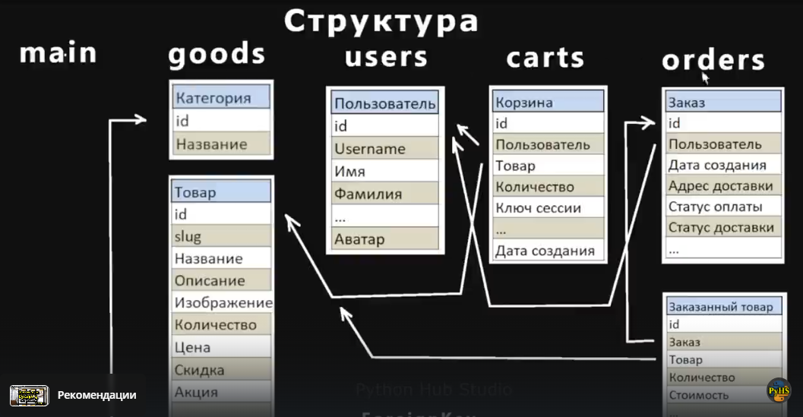
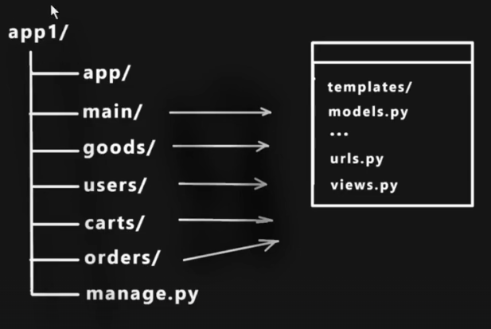
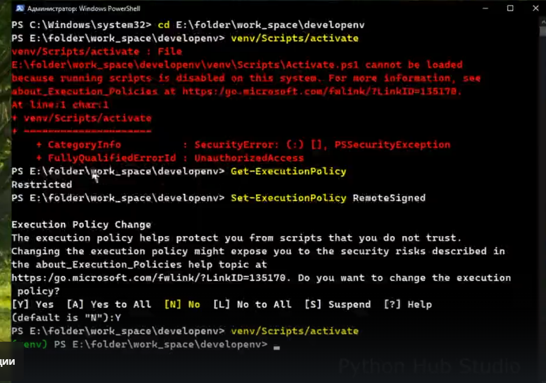
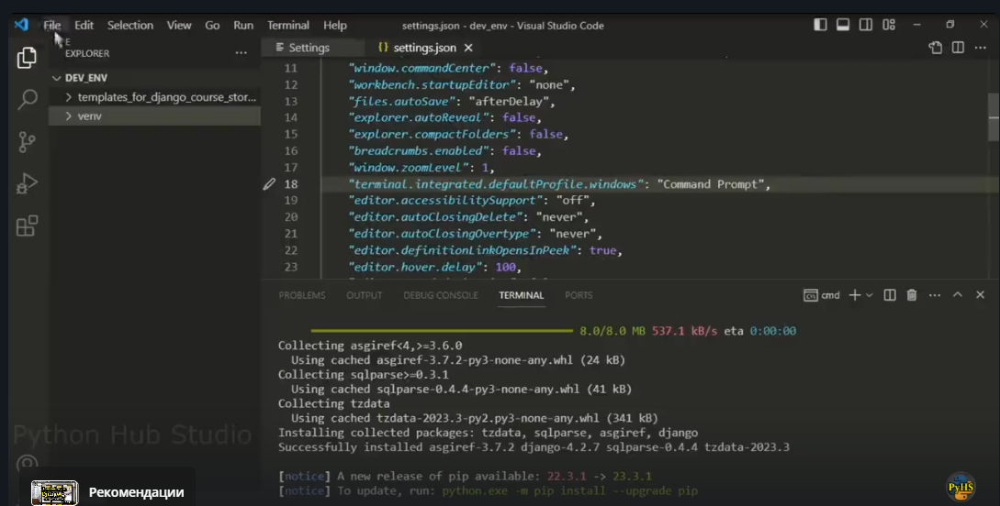
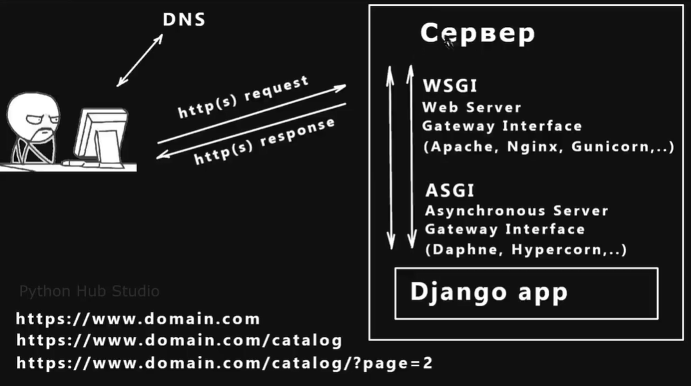
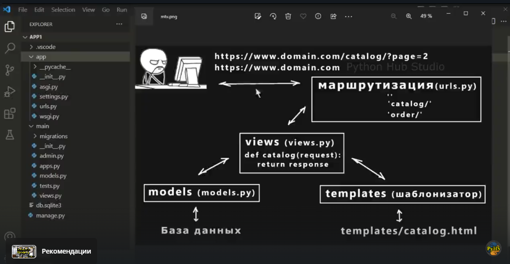
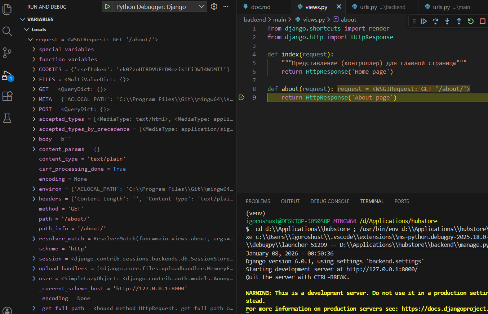

- wsgi
- asgi
- pycache
- копирование проекта (по шаблону, как делали в SF)
- статические файлы в Django

### Структура проекта
**Сущности**


Чем лучше программист разобьёт приложение на разные структурные компоненты, тем будет проще:
- Обслуживать код
- Масштабировать
- Копировать структуру в другие проекты

**Приложения в проекте**



### pip
`pip` - менеджер пакетов для языка программирования python. Он служит для установки, обновления, удаления и управления программными пакетами (библиотеками, модулями), написанными на Python.

### Решение проблемы с активацией venv
1. Отключение защиты


2. `file -> preferences -> settings`:



### Файлы
- `__pycache__` - закэшированная версия файлов внутри backend (startproject) для ускорения запуска. Появляется при первом запуске приложения в каждой папке, где есть python-файлы.
- `__init.py__` - говорит интерпретатору пайтон, что все файлы связаны (пакет из взаимосвязанных файлов). Файл всегда пуст.
- `asgi, wsgi` - Файлы отвечают за "общение" Django-приложения с сервером. Это стандартизированные протоколы взаимодействия между сервером и приложением. 
- `urls.py` - маршруты приложения.
- `apps.py` - настройка конфигурации конкретного приложения

### WSGI и ASGI
**WSGI**
WSGI (Web Server Gateway Interface) - apache, Nginx, Gunicorn, ... - стандартный синхронный протокол взаимодействия (для каждого запроса-ответа создаётся отдельный поток выполнения). Лучше использовать для интернет-магазинов.

**ASGI**
ASGI (Asynchronous Server Gateway Interface) - асинхронное взаимодействие между Django и сервером. 


**Использование**
Если написан синхронный вариант - публикуем на сервер, поддерживающий это решение (Apache, Nginx, Gunicorn, ...), если асинхронный - то публикуем на сервер, поддерживающий такой способ взаимодействия.
WSGI лучше для интернет-магазинов, онлайн-порталов, ASGI - стриминговые платформы, онлайн-чаты.


### MVC наглядно


При переходе по маршруту срабатывает закреплённый view, который выдаёт логику (достаёт информацию из базы данных -models) и прикручивает шаблоны.


### Содержимое request



### Разное
- Отображение динамических данных в шаблоне
```python
def index(request):
    """Представление (контроллер) для главной страницы"""
    context = {
        'title': 'Home',
        'content': 'Главная страница магазина - HOME',
        'list': ['first', 'second'],
        'dict': {'first': 1},
        'bool': True
    }
    return render(request, 'main/index.html', context)
```
```html
<body>
    <p>{{ content }}</p>
    <p>{{ list }}</p>
    <p>{{ list.0 }}</p> <!-- first  (через точку в списке) -->
    <p>{{ dict }}</p>
    <p>{{ dict.first }}</p> <!-- 1 (по ключу в словаре) -->
    <p>{{ bool }}</p>
```

**Структура папок**
- `app -> templates -> app -> files`
- `app -> static -> app -> files` (если стили для конкретного приложения)


### Команды
- `git log --graph --all --oneline` - вся история коммитов в одной строчке
- `git checkout 80879fe` (хэш коммита) - переход к конкретной версии кода


### Атрибут name (urls.py)
Атрибут name служит уникальным идентификатором для конкретного пути. Это ключевой механизм для обратного разрешения URL (reverse URL resolution) - то есть для получения URL-адреса по его имени, а не по жёстко прописанной строке.

### Атрибут namespace
Пространство имён (namespace) в Django-маршрутах нужно, чтобы однозначно различать URL-адреса, когда в проекте есть:
- Несколько приложений с одинаковыми именами маршрутов
- Одно приложение, подключённое несколько раз с разными префиксами

1. Указываем namespace в корневом urls
```python
 path('', include('main.urls', namespace='main')),
 ```
2. В urls приложения прописываем
 ```python
app_name = 'main'  # иначе django выдаст ошибку, не обязательно должен совпадать
 ```
3. В шаблонах, где используется путь (url), дополняем префикс по имени
```python
<a class="navbar-brand" href="">Home</a>
```

### app_name (urls)
app_name определяет логическое имя приложения (его идентификатор внутри проекта). Используется для группировки маршрутов внутри приложения. Должно быть уникальным среди всех приложений проекта.
app_name - кто я? (приложение)
namespace - где я? (контекст подключения)

app_name определяет приложение, namespace определяет его экземпляр в URL-дереве.